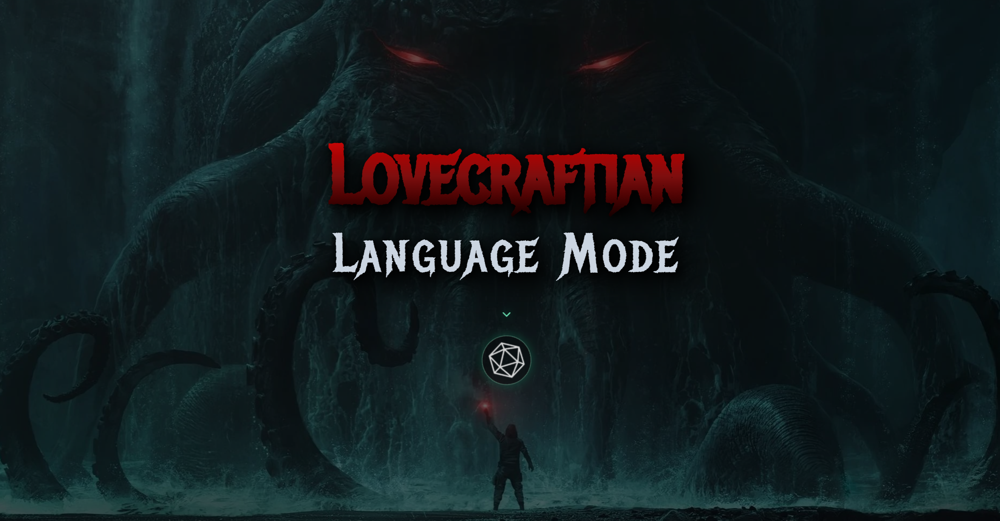
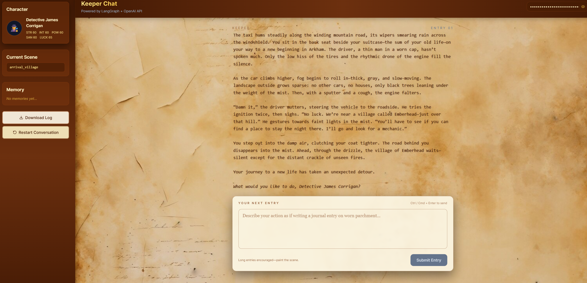
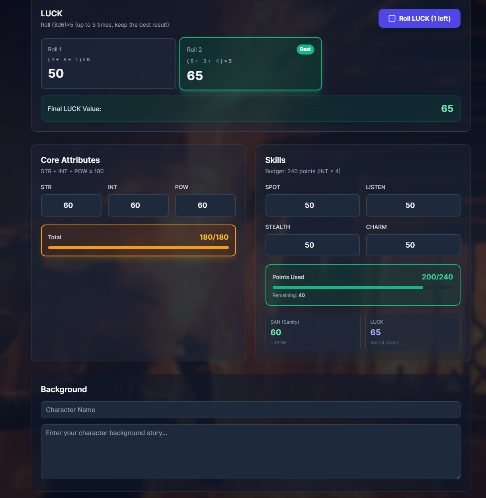

# CoC Solo · LLM Keeper

<div align="center">



**An AI-powered solo Call of Cthulhu RPG experience**

[Features](#-features) • [Installation](#-installation) • [Quick Start](#-quick-start) • [Tutorial](#-tutorial) • [Deployment](#-deployment)

[](https://www.python.org/)
[](https://nextjs.org/)
[](https://fastapi.tiangolo.com/)
[](https://langchain-ai.github.io/langgraph/)

</div>

---

## 🎯 What Problem Does This Solve?

**CoC Solo · LLM Keeper** solves the fundamental challenge of playing tabletop RPGs alone. Traditional solo RPGs often feel mechanical and lack the dynamic storytelling that makes tabletop RPGs engaging. This project brings together:

- **AI-powered Game Master**: An intelligent Keeper that adapts to your choices and creates immersive narratives
- **No Scheduling Hassles**: Play whenever you want, without coordinating with other players
- **Rich Storytelling**: Experience dynamic, branching narratives powered by advanced LLM technology
- **Authentic CoC Experience**: Full support for Call of Cthulhu mechanics including dice rolls, SAN checks, and scene transitions

### Who Is This For?

- **Solo RPG Enthusiasts** who want to experience Call of Cthulhu without a group
- **RPG Players** looking to practice character creation and game mechanics
- **Developers** interested in AI agent architectures and LLM applications
- **Storytellers** who enjoy interactive fiction and narrative exploration
- **Educators** teaching game design, AI, or interactive storytelling

---

## ✨ Features

### 🎭 Intelligent AI Keeper
- Powered by **LangGraph** state machine architecture
- Dynamic scene management with structured narrative templates
- Context-aware responses that adapt to your character and choices
- Long-term memory system that maintains story coherence across sessions

### 🎲 Authentic Game Mechanics
- **3D Dice Rolling**: Interactive WebAssembly-powered dice interface
- **Skill Checks**: Automatic difficulty calculation (Easy/Normal/Hard/Extreme)
- **Sanity System**: SAN checks with proper loss mechanics
- **Character Management**: Full character sheet with attributes and skills

### 📖 Dynamic Storytelling
- **Scene System**: Structured scenes with NPCs, clues, and transitions
- **Memory System**: Automatic summarization of key events every 4 turns
- **Branching Narratives**: Your choices shape the story
- **Atmospheric Writing**: Immersive, Lovecraftian-style prose

### 🎨 Modern Interface
- **Beautiful UI**: Tailwind CSS with parchment-style aesthetics
- **Typewriter Effect**: Dramatic text reveal for Keeper responses
- **Real-time Updates**: Live scene transitions and character stat changes
- **Session Logging**: Automatic Markdown logs of your adventures

### 🔧 Developer-Friendly
- **Modular Architecture**: Clean separation between frontend and backend
- **Extensible**: Easy to add new scenes, NPCs, or game mechanics
- **Well-Documented**: Comprehensive code structure and API documentation
- **Deployment Ready**: One-command deployment to Vercel + Render

---

## 📸 Screenshots

> **Note**: Add your screenshots to the `docs/` folder and update the paths below.

<div align="center">

### Main Chat Interface

*The immersive chat interface with character sidebar and memory system*

### Character Creation

*Create your investigator with custom attributes and background*

### Dice Rolling

*Interactive 3D dice rolling for skill checks and SAN tests*

### Scene Transitions

*Dynamic scene transitions with context-aware narration*

</div>

---

## 🚀 Installation

### Prerequisites

Before you begin, ensure you have the following installed:

- **Python 3.8+** ([Download](https://www.python.org/downloads/))
- **Node.js 18+** and npm ([Download](https://nodejs.org/))
- **Git** ([Download](https://git-scm.com/downloads))
- **OpenAI API Key** ([Get one here](https://platform.openai.com/api-keys))

### Step 1: Clone the Repository

```bash
git clone <repository-url>
cd "Lovecraftian Language Mode"
```

### Step 2: Install Python Dependencies

```bash
# Install base dependencies
pip install -r requirements.txt

# Install web server dependencies
pip install -r requirements-web.txt
```

### Step 3: Install Node.js Dependencies

```bash
cd web
npm install
cd ..
```

### Step 4: Configure Environment (Optional)

If you want to set a default OpenAI API key for the backend, create a `.env` file in the root directory:

```bash
OPENAI_API_KEY=your-api-key-here
```

> **Note:** You can also enter your API key directly in the frontend sidebar, which stores it locally in your browser.

---

## 🎮 Quick Start

### Option 1: Manual Start (Recommended for Development)

**Terminal 1 - Start FastAPI Backend:**
```bash
python api_server.py
```
The backend will be available at `http://localhost:8000`

**Terminal 2 - Start Next.js Frontend:**
```bash
cd web
npm run dev
```
The frontend will be available at `http://localhost:3000`

### Option 2: Quick Start Scripts

**Windows:**
```bash
start-web.bat
```

**macOS/Linux:**
```bash
chmod +x start-web.sh
./start-web.sh
```

These scripts will automatically start both the backend and frontend servers.

---

## 📚 Tutorial: Your First Adventure

This tutorial will walk you through creating a character and starting your first game session.

### Step 1: Create Your Investigator

1. **Navigate to Character Creation**
   - Open `http://localhost:3000` in your browser
   - You'll be redirected to the character creation page

2. **Fill in Character Details**
   ```
   Name: Dr. Eleanor Vance
   Background: A professor of archaeology at Miskatonic University, 
               specializing in ancient civilizations and forbidden texts.
   ```

3. **Set Attributes** (or use random generation)
   - **STR** (Strength): 50
   - **INT** (Intelligence): 70
   - **POW** (Power): 60
   - **SAN** (Sanity): 65

4. **Set Skills**
   - **SPOT** (Spot Hidden): 60
   - **LISTEN**: 50
   - **STEALTH**: 40
   - **CHARM**: 55
   - **LUCK**: 50

5. **Click "Start Adventure"**

### Step 2: Enter Your API Key

1. In the sidebar, find the **OpenAI API Key** input field
2. Enter your API key (stored locally in your browser)
3. The key is used for all LLM interactions

### Step 3: Begin Your Journey

1. **Read the Opening Scene**
   - The Keeper will present the opening narrative
   - You're in a taxi heading to Arkham when it breaks down near Emberhead

2. **Make Your First Action**
   ```
   Example: "I step out of the taxi and look around. 
            The mist is thick, but I can see lights in the distance. 
            I decide to walk toward the village."
   ```

3. **Observe the Response**
   - The Keeper will narrate what happens
   - Watch for skill checks or scene transitions

### Step 4: Understanding Game Mechanics

#### Skill Checks
When the Keeper requests a skill check:
- A **"Roll Dice"** button will appear
- Click it to roll a 3D dice
- The result is automatically calculated and incorporated into the narrative

#### SAN Checks
When encountering something horrifying:
- A **Sanity Check** will be triggered
- Roll to see if you maintain your composure
- Failure results in SAN loss

#### Scene Transitions
- The Keeper automatically transitions scenes based on your actions
- Current scene is displayed in the sidebar
- Each scene has unique NPCs, clues, and atmosphere

#### Memory System
- Every 4 turns, key events are automatically summarized
- Memory entries appear in the sidebar
- These help maintain long-term story coherence

### Step 5: Explore and Experiment

Try different approaches:
- **Investigate**: Use SPOT and LISTEN to find clues
- **Socialize**: Use CHARM to interact with NPCs
- **Stealth**: Use STEALTH to avoid detection
- **Observe**: Pay attention to scene descriptions and NPC behaviors

### Example Play Session

```
You: "I approach the village cautiously, keeping to the shadows."

Keeper: "The mist clings to your coat as you move closer. 
        Through the gloom, you see a figure standing near 
        what appears to be a general store. They haven't 
        noticed you yet. [Roll Dice: Stealth Check Required]"

[You click Roll Dice, get a result of 45]

Keeper: "[Stealth Check - Normal]
         Roll: 45/40
         Result: **Failure**
         
         You step on a loose stone, and it clatters loudly. 
         The figure turns—it's a woman in a worn dress. 
         She looks surprised but not hostile. 'Oh! You're 
         the one from the taxi, aren't you? I'm May Ledbetter. 
         The inn's closed, but you can stay at my house tonight.'"
```

### Tips for Best Experience

1. **Be Descriptive**: The more detail you provide, the richer the narrative
2. **Stay In Character**: Think about what your investigator would do
3. **Explore**: Don't rush—investigate scenes thoroughly
4. **Read Carefully**: NPCs and clues are important for the story
5. **Use Memory**: Check the sidebar memory to recall past events

---

## 🏗️ Project Structure

```
agents/            # LangGraph Keeper, scenarios, and tools
utils/             # Session state, Markdown logging
api_server.py      # FastAPI server for Next.js frontend
web/               # Next.js 14 + Tailwind frontend
  ├── app/chat     # Keeper chat interface
  ├── app/create-character
  ├── app/api      # API routes (proxies to Render backend)
  ├── store        # Zustand state management
  └── lib          # API client utilities
docs/              # Screenshots and documentation assets
```

---

## 🌐 Deployment

### Frontend
- Deploy to **Vercel** (from `web/` directory)
- Set environment variable: `PYTHON_BACKEND_URL`

### Backend
- Deploy to **Render / Railway / Fly.io**
- Run command: `uvicorn api_server:app --port $PORT`
- Set environment variable: `ALLOWED_ORIGINS`

For detailed deployment instructions, see `deploy-vercel-render.md`.

---

## 🔑 OpenAI API Key

The API key input in the frontend sidebar is stored locally in your browser. Alternatively, you can set a default API key via the `OPENAI_API_KEY` environment variable in your deployed Python backend.

**Cost Considerations**: This project uses `gpt-4o-mini` for cost efficiency. Typical sessions cost approximately $0.01-0.05 per hour of gameplay, depending on message length and frequency.

---

## 🐛 Troubleshooting

- **Port already in use**: Make sure ports 8000 (backend) and 3000 (frontend) are not occupied by other applications
- **Module not found**: Ensure all dependencies are installed correctly
- **API errors**: Verify your OpenAI API key is valid and has sufficient credits
- **CORS errors**: Check that `ALLOWED_ORIGINS` environment variable includes your frontend URL
- **Memory not updating**: Ensure `turn_count` is being passed correctly from frontend

---

## 🤝 Contributing

Contributions are welcome! Areas where help is needed:

- Additional scenes and scenarios
- NPC character development
- UI/UX improvements
- Performance optimizations
- Documentation improvements

---

## 📄 License

[GPL-3.0 license]

---

## 🙏 Acknowledgments

- Built with [LangGraph](https://langchain-ai.github.io/langgraph/) and [LangChain](https://www.langchain.com/)
- Inspired by "Alone Against the Flames" solo scenario
- Uses [@3d-dice/dice-box](https://github.com/3d-dice/dice-box) for dice rendering

---

<div align="center">

**Made with ❤️ for the Call of Cthulhu community**

[Report Bug](https://github.com/yourusername/repo/issues) • [Request Feature](https://github.com/yourusername/repo/issues) • [Documentation](./docs/README.md)

</div>
